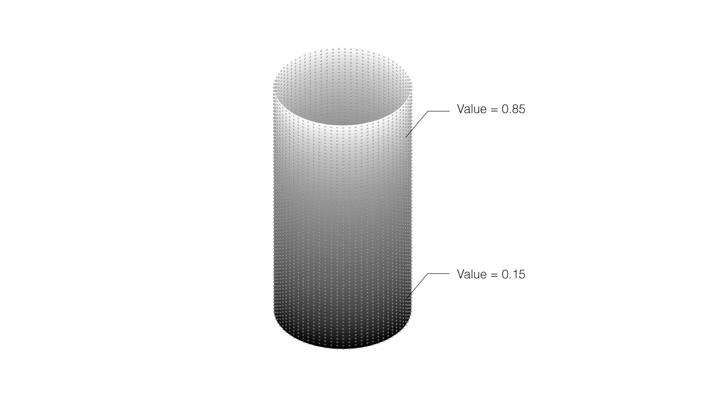
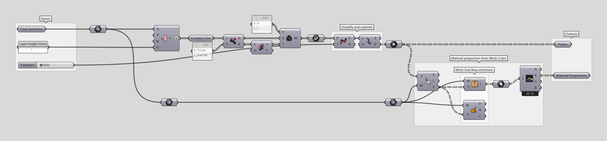

# Double_Material-Extruder_Printing_Information

The following code constructs points with material proportion information from a colored mesh to be used for robotic multi-material 3D-printing.

## Inputs:

| Name          |Description     | Type  |
| ------------- |-------------| -----|
| Mesh      | Colored mesh | mesh |
| Layer Height      | Layer height for 3D-printing | number |
| Tolerance      | Allowed deviation between original curve and printing path | number |

## Outputs:

| Name          |Description     | Type  |
| ------------- |-------------| -----|
| Points      | Points to be used for robotic path planning | points |
| Material proportion      | Proportion material A / B (0 to 1)| number |

## Description:

-  The input mesh is contoured based on layer height in 'Z' direction.
- Each two consecutive layers are modified to have opposite printing directions.
- The contour curves are reduced to polylines based on 'Tolerance' number.
- From each discontinuity point on polyline, closest vertex color is assigned as material proportion information.

### Prerequisites

> [Rhino 5](https://www.rhino3d.com/download/rhino/5/latest) + [Grasshopper](https://www.grasshopper3d.com/page/download-1) / [Rhino 6](https://www.rhino3d.com/download)  

## Authors

## Acknowledgments
